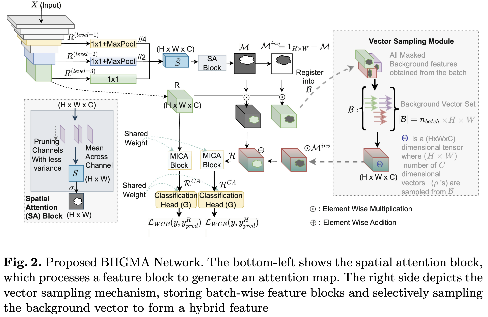
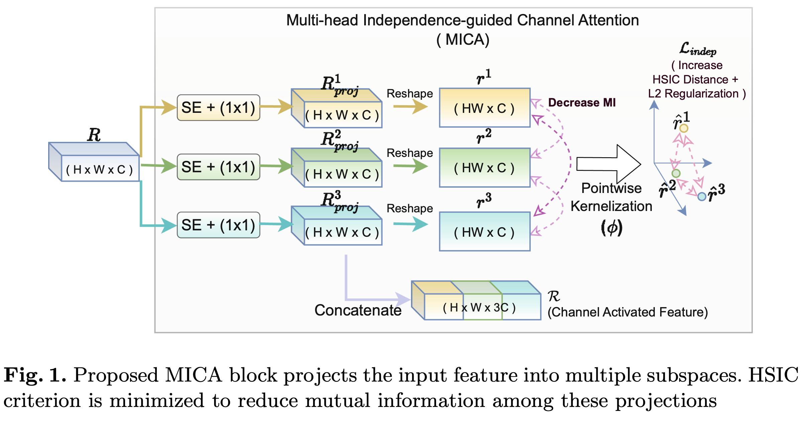
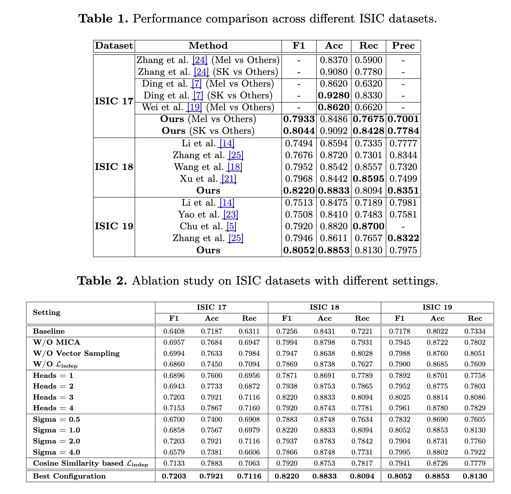

# BIIGMA-Net : Background-Invariant Independence-Guided Multi-head Attention Network for Skin Lesion Classification
Official Implementation of Paper "Background-Invariant Independence-Guided Multi-head Attention Network for Skin Lesion Classification"

Accepted at  **MICCAI 2025**
Papaer Link: https://papers.miccai.org/miccai-2025/paper/2868_paper.pdf
Datasets: https://drive.google.com/drive/folders/1dyodI0nLil1P2_FoyGB10jDl5Gan2kMA?usp=drive_link (Download skin lesion datasets here and place them in `data/` folder)



## Abstract

Biomedical image classification faces several adversarial challenges, including occlusions from artifacts, variations in tissue pigmentation, and class imbalance, which hinder model generalization. Existing attention mechanisms enhance region localization but often introduce redundant dependencies across attention heads, limiting feature diversity. We propose the Background-Invariant Independence-Guided Multi-head Attention Network (BIIGMA-Net) to address these issues. BIIGMA-Net employs Multi-head Independence-Guided Channel Attention (MICA), where each head independently learns feature importance while enforcing neuron-wise independence using the Hilbert-Schmidt Independence Criterion (HSIC) to enhance feature diversity. Additionally, a saliency-driven mechanism suppresses background activations by selectively shuffling non-salient vectors, preventing the model from relying on static background cues. By integrating these strategies, BIIGMA-Net improves robustness against spurious background noise while ensuring complementary feature extraction. Extensive experiments on popular skin cancer datasets (ISIC-17, ISIC-18 and ISIC-19) demonstrate the framework’s effectiveness and robustness. Our code is available at: https://github.com/shb2908/BIIGMA-Net

In our proposed Background-Invariant Independence-Guided Multi-head Attention (BIIGMA-Net), we enforce independence across projection heads in the channel attention block by minimizing mutual information, reducing redundancy in feature representation. To improve robustness against spurious background noise, we generate a hybrid feature map by selectively shuffling non-salient vectors using an inverted saliency map, ensuring classification consistency. To the best of our knowledge, this is the first work integrating an independence criterion in CNN-based attention heads alongside background agnosticism.

The key contributions of our work are:
1.  **Multi-head Independence-Guided Channel Attention (MICA):** We introduce a multi-head channel attention mechanism where each head independently learns feature importance. To enforce decorrelation, we use the Hilbert-Schmidt Independence Criterion (HSIC) at the neuron level instead of covariance matrices, which fail to capture higher-order dependencies. This ensures diverse and complementary feature extraction, reducing redundancy and more information count in the final representation.

    

2.  **Spatial Attention Guided Background Invariance:** To suppress irrelevant background features while preserving discriminative information, we employ a saliency-driven mechanism that samples and shuffles background feature vectors. This prevents reliance on static background cues, enhancing robustness against background variations and spurious correlations.

## Results

### Comparison and Ablation Study


## Code Overview

This repository has been refactored into a modular and configurable structure.

### `main.py`
This is the main entry point for the application. It handles the overall workflow:
1.  Initializes the configuration.
2.  Loads the dataset.
3.  Builds the model.
4.  Starts the training process.

### `config.py`
This file manages all the hyperparameters and settings for the project. It uses environment variables to allow for easy configuration without modifying the source code. Default values are provided within the `set_default_config` function.

### `keras-src/`
This directory contains the core source code, organized into the following modules:

-   **`data/`**: Contains `dataset.py` for data loading, preprocessing, and data augmentation.
-   **`loss/`**: Includes all custom loss functions used in the model, such as `HybridLoss`, `KernelLoss`, and `WeightedXCE`.
    -   The **Kernel Loss (HSIC)** is implemented in `keras-src/loss/kernel_loss.py`. It calculates the Hilbert-Schmidt Independence Criterion to enforce independence between the feature maps from different attention heads.
-   **`model/`**: Defines the neural network architecture.
    -   `components.py`: Contains individual building blocks and layers of the model. The **Vector Sampling** mechanism is implemented as the `VectorSamplingLayer` in this file.
    -   `custom_model.py`: Implements the custom `MyModel` class with the `train_step` and `test_step`.
    -   `build_model.py`: Contains the function to assemble the complete model.
-   **`utils/`**: Provides utility functions and classes.
    -   `callbacks.py`: Includes custom Keras callbacks for training, such as `MetricsCallback` and `NaNCallback`.
    -   `metrics.py`: Defines custom metrics for evaluating the model's performance.

### `requirements.txt`
This file lists all the Python dependencies required to run the code. You can install them using:
```bash
pip install -r requirements.txt
```

### How to Run
To train the model, simply run the `main.py` script from the root of the project directory:
```bash
cd keras-src  # Change to the script's directory
python main.py
```
You can modify the hyperparameters by setting environment variables before running the script.

